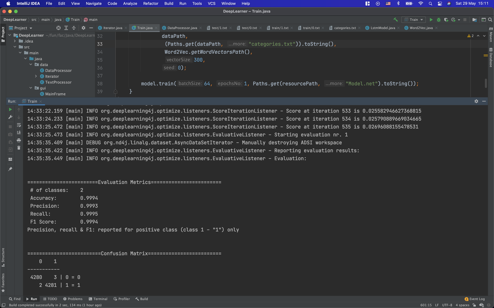

# DeepLearner
## Info
Proiect facut pentru Programare Avansata impreuna cu Rares Radu (https://github.com/raresradua).
Modul de lucru adoptat, a fost Pair Programming (lucrand la proiect impreuna, de pe o singura masina).

## Proiect
Proiectul a constat in a implementa o retea neuronala, antrenand-o pe un dataset la alegere si oferind o interfata grafica pentru utilizator, pentru a o folosi.

Subiectul ales a fost Fake News Detection, deoarece este cu dezvoltarea mediului online, problema stirilor false si a dezinformarii devine din ce in ce mai serioasa si de asemenea, am lucrat amandoi pe partea de AI la proiectul de la `Ingineria Programarii`, care a avut aceiasi tema.

Dataset-ul folosit a fost https://www.kaggle.com/clmentbisaillon/fake-and-real-news-dataset. Acesta consta in doua fisiere .csv, care contin stiri adevarate, respectiv false.

## Tehnologii
Libraria folosita pentru a crea modelul si a procesa dataset-ul a fost `DeepLearning4J`. Pentru interfata grafica am folosit `Java Swing`.

## Implementare
Proiectul este impartit in doua parti. Prima parte, crearea si antrenarea modelului, iar a doua parte, cea care o vede utilizatorul, consta in incarcarea modelului pre-antrenat si oferind predictii cu ajutorul sau.

## Procesare dataset
Dataset-urile mentionat mai sus (.csv), a fost procesat in urmatorul mod:
* Extras fiecare coloana din fiecare linie
* Concatenat partile text (titlul si articolul) al fiecarei intrari
* Transformat text-ul obtinut in lowercase
* Inlocuit caracterele care `NU` sunt alfa-numerice cu spatiu
* Salvata fiecare intrare procesata intr-un nou fisier .txt, corespunzator clasesi sale (true, fake), numite pentru simplitate 0.txt si 1.txt

Cele doua fisiere obtinute dupa procesarea mentionata mai sus, au fost impartite in date de antrenament, respectiv de test cu proportie de (80/20). Datele de test sunt folosite pentru a evalua performanta modelul (i.e. acuratetea clasificarii).

## Crearea si antrenarea modelului
Configuratia modelului creat, foloseste arhitecura RNN si mai specific `LSTM (Long short term memory)`. Am ales `LSTM`, deoarece acest tip de retea neuronala se comporta, in general, foarte bine pe clasificarea de text.

Model:
* Algoritmul folosit pentru a updata parametrii este `Adam` cu un `learning rate` de `5e-3`.
* "Costurile" (weight-urile) dintre neuronii retelei au fost initializati folosind `XAVIER`.
* Dupa layer-ul LSTM, functia de activare folosita a fost `SOFTMAX`, iar functia de pierdere `Maximum entropy`.

Ca si input, modelul primeste textul vectorizat. Pentru vectorizare am folosit modelul `Word2Vec`. Am ales o varianta pre-antrenata de `Google-News`, careia ii facem download pe masina utiliatorului folosind un obiect de tip `Downloader` (in caz ca nu exista deja).
Inainte de vectorizare, tokenizam textul, iar apoi fiecare cuvant tokenizat este inlocuit cu output-ul `Word2Vec`-ului.

Modelele din `DeepLearning4J`, pentru antrenare, au nevoie de un iterator (care implementeaza `DataSetIterator` peste dataset. Aici vectorizam text-ul care urmeaza sa fie "hranit" modelului.

Rezultatele antrenarii au fost foarte bune, obtinand pe datele de test, o acuratete de 99%.

## Interactiunea cu utilizatorul
Cand rulam aplicatia, modelul antrenat si stocat in `resources`, este incarcat.
Dupa incarcare, utilizatorul poate introduce stiri (text) si sa obtina o predictie.
